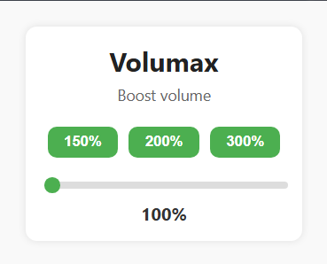

<h1 align="center">🔊 Volumax - Chrome Sound Booster Extension</h1>

<p align="center">
  
</p>

<p align="center">
  <b>Supercharge your browser's audio experience — tab by tab.</b><br/>
  Boost volume up to <strong>300%</strong> on any website with a single click!
</p>

<p align="center">
  
  
</p>

---

## 🚀 Features

- 🎚️ **Volume Boost** up to **300%** on any site.
- 🧠 **Per-Tab Volume Control** — independent boost levels for each tab.
- ⚡ **One-Click Presets** for instant boost to **150%**, **200%**, or **300%**.
- 🌐 Works across **all websites** (YouTube, Spotify, Netflix, etc).
- 🧼 Resets when you close a tab — **no storage or clutter**.

---

## 🖼️ UI Preview



---

## 🛠️ Installation

1. Clone or download this repository:
   ```bash
   git clone https://github.com/edwinjoel1202/Volumax-Sound-Booster.git
